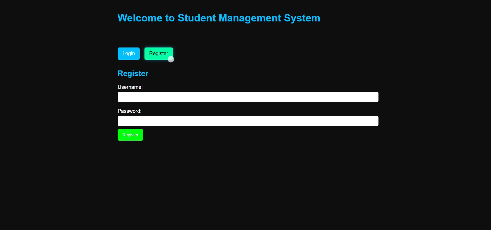
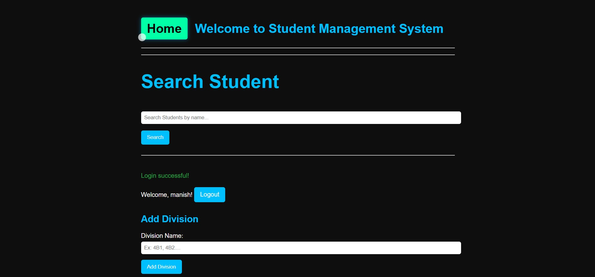

# [Simple Demographic Student Details Management](https://flask-forms.vercel.app/)

A web application for managing student demographic details using Flask. This project serves as a practical introduction to Flask and web development concepts.

## Table of Contents

- [Features](#features)
- [Technologies Used](#technologies-used)
- [Installation](#installation)
- [Usage](#usage)
- [Code Structure](#code-structure)

## Visuals

<a href="https://github.com/Manish-Let-It-Be/Flask_Forms">
    
</a>

<a href="https://github.com/Manish-Let-It-Be/Flask_Forms">
    
</a>

https://github.com/user-attachments/assets/ebf2e6e7-c783-45ee-8c5b-c5d710946f78


## Features

- **User Authentication**: Register and log in to manage student data.
- **CRUD Operations**: Create, read, update, and delete student details.
- **Division Management**: Organize students by divisions.
- **Search Functionality**: Easily search for students by name or ID.
- **Data Export**: Export student data to Excel files.

## Technologies Used

- **Flask**: A micro web framework for Python.
- **HTML/CSS**: For structuring and styling the web application.
- **SQLite**: Lightweight database for storing student details.
- **Pandas**: For handling data and exporting to Excel.
- **Werkzeug**: For password hashing and session management.

## Installation

### [Web](https://flask-forms.vercel.app/)

To set up the project locally, follow these steps:

1. **Clone the repository**:
   ```bash
   git clone https://github.com/Manish-Let-It-Be/Flask_Forms.git
   cd Flask_Forms
   ```

2. **Create a virtual environment**:
   ```bash
   python -m venv venv
   ```

3. **Activate the virtual environment**:
   - On Windows:
     ```bash
     venv\Scripts\activate
     ```
   - On macOS/Linux:
     ```bash
     source venv/bin/activate
     ```

4. **Install the required packages**:
   ```bash
   pip install -r requirements.txt
   ```

5. **Run the application**:
   ```bash
   python app.py
   ```

6. **Open your browser** and go to `http://127.0.0.1:5000`.

## Usage

- **Register**: Create an account to log in.
- **Login**: Access the dashboard to manage student details.
- **Add Division**: Create divisions for organizing students.
- **Add Student**: Add students to a division.
- **Search Students**: Use the search bar to find students by name or ID.
- **Export Data**: Download student data as an Excel file.

## Code Structure

- **app.py**: The main application file that contains routes, logic for managing student data, and user authentication.
- **data/**: Contains JSON files for storing user accounts and student data.
- **templates/**: HTML files for rendering the user interface (e.g., forms for adding students, displaying results).
- **static/**: Contains static files like CSS and JavaScript.

### Key Functions

- `load_data()`: Loads student data from a JSON file.
- `save_data(data)`: Saves student data to a JSON file.
- `login_required(f)`: Decorator to ensure user authentication for certain routes.

---

<p align="center">
  
</p>

